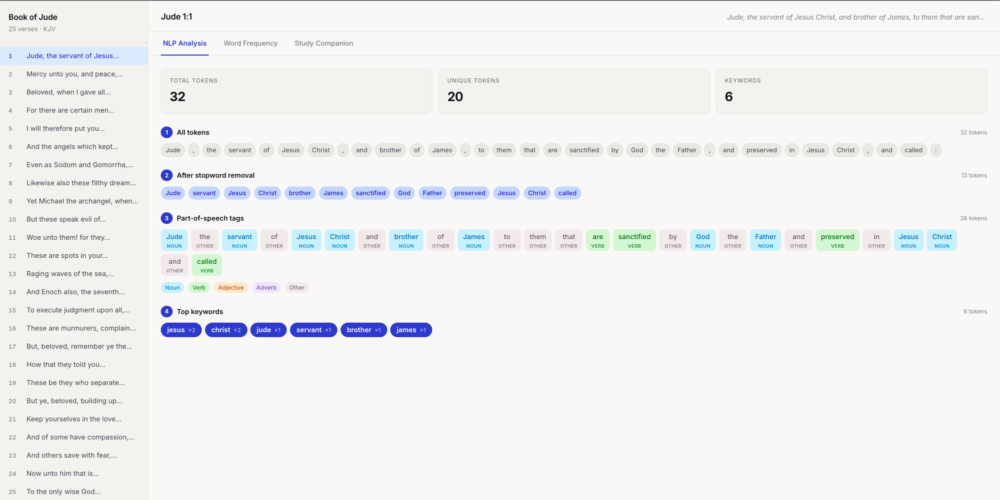

# BIT4133: Natural Language Processing with Deep Learning

**Progress Doc:** [Notion](https://app.notion.com/p/firebasedocs/NLP-Progress-Doc-BIT4133-Natural-Language-Processing-with-Deep-Learning-368031679001802fa604e9774853ebb5?source=copy_link)

---

## Project: AI Bible Study Companion

A web application that applies NLP techniques to the Book of Jude (KJV). It performs tokenization, stopword removal, POS tagging, keyword extraction, and word frequency analysis — and uses GPT-4o-mini to generate AI-powered study notes.



---

## Repository Structure

```
nlp-product/
├── jude-companion/        # Main project application
│   ├── backend/           # FastAPI + NLTK NLP pipeline
│   │   ├── main.py        # API endpoints
│   │   ├── nlp_pipeline.py
│   │   └── jude_corpus.py
│   └── frontend/          # React + Vite UI
│       └── src/
│
├── week-1/                # Tokenization & Stopwords Removal
│   ├── code/
│   ├── screenshots/
│   └── README.md
│
├── week-2/                # N-gram Models & POS Tagging
│   ├── code/
│   ├── screenshots/
│   └── README.md
│
├── week-3/                # Hidden Markov Models & NER
│   ├── code/
│   ├── screenshots/
│   └── README.md
│
└── week-N/                # Subsequent weeks follow the same structure
```

Each `week-N/` folder contains:
- `code/` — standalone Python script demonstrating that week's concepts
- `screenshots/` — evidence figures required by the assignment
- `README.md` — write-up, figure captions, and student reflection

---

## Tech Stack

| Layer | Technology |
|---|---|
| NLP | Python, NLTK, MACULA Greek NT |
| Backend | FastAPI, Python 3.9 |
| Frontend | React, Vite, Recharts |
| AI Layer | OpenAI API (GPT-4o-mini) |

---

## Running the Project

```bash
# Backend
cd jude-companion/backend
pip install -r requirements.txt
python3 -m uvicorn main:app --reload --port 8000

# Frontend
cd jude-companion/frontend
npm install
npm run dev
```
