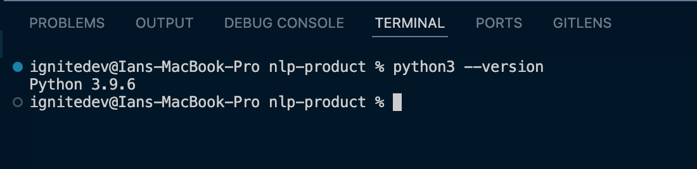
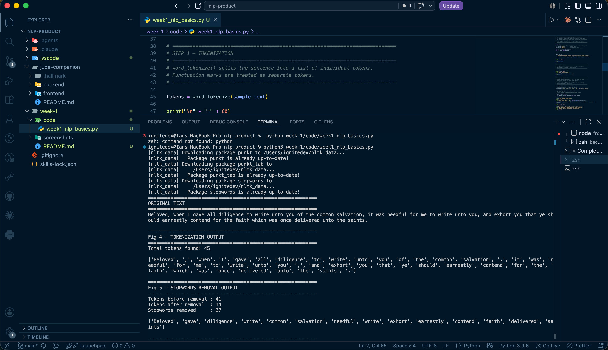
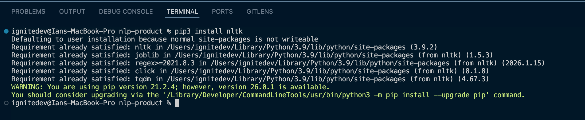
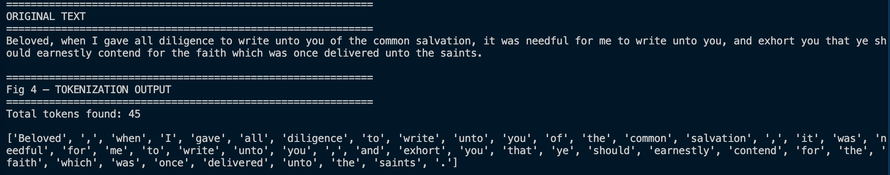
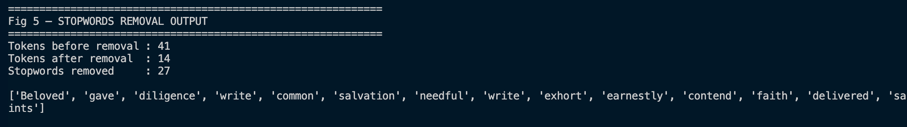
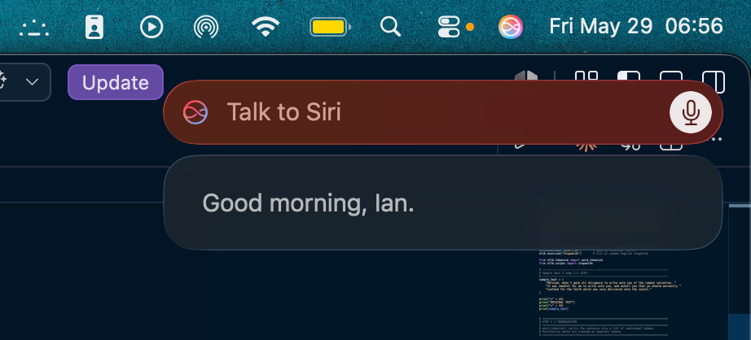

# Week 1 – Introduction to NLP and Applications
---

## Task: NLP Concepts and Text Processing

### Fig 1 – Python Installation


### Fig 2 – Local Development Setup


### Fig 3 – NLTK Installation


### Fig 4 – Tokenization Output


Fig 4 demonstrates tokenization of a verse from Jude 1:3 using NLTK's `word_tokenize()`. The sentence is broken into individual word tokens for preprocessing — a required first step before any NLP analysis.

### Fig 5 – Stopwords Removal Output


Fig 5 shows the token list after filtering out common English words (*the*, *and*, *was*) and KJV-specific words (*unto*, *ye*, *thee*). Only the meaningful terms remain.

### Fig 6 – NLP Application Research Evidence


Fig 6 shows an interaction with Siri — an NLP application that uses speech recognition and intent detection to understand and respond to natural language in real time.

---

## Student Reflection

This week introduced core NLP concepts — tokenization and stopword removal — using Python and the NLTK library. I applied these techniques to a verse from the Book of Jude, the same text my main project analyses. Tokenization breaks a sentence into individual words so a program can process them one at a time. Stopword removal then filters out common words like *the* and *and*, leaving only meaningful terms. I also explored real-world NLP applications such as Siri, which uses speech recognition and intent detection to understand and respond to natural language, as shown in Fig 6 above.

---

## Running the Code

```bash
pip install nltk
python week-1/code/week1_nlp_basics.py
```
