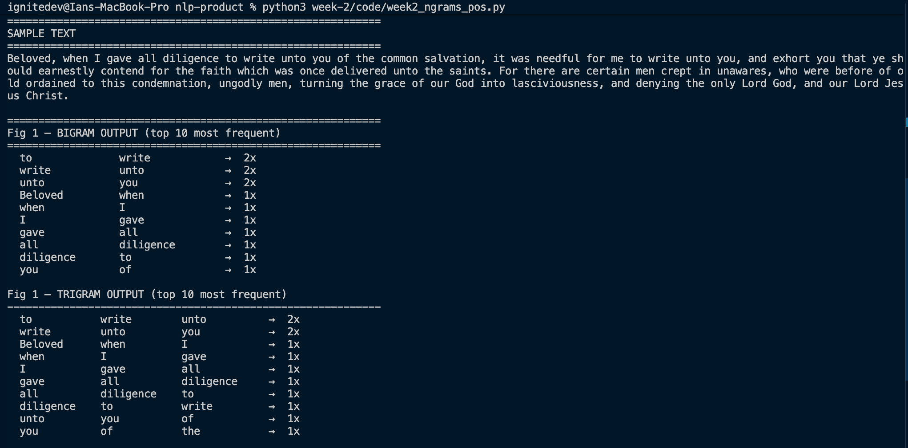
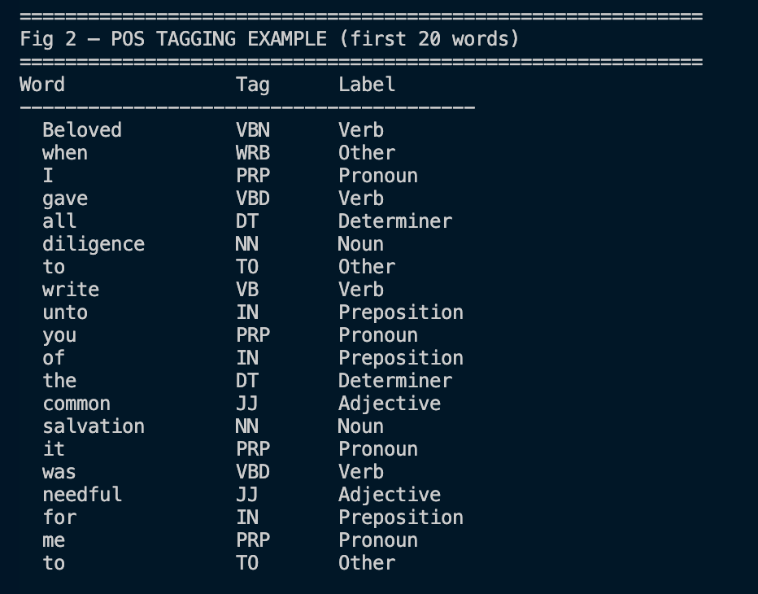
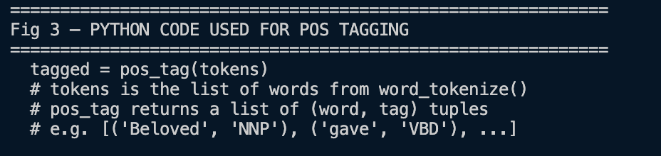
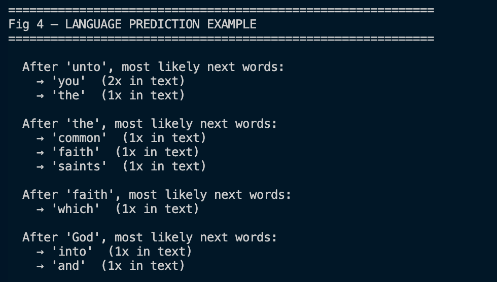
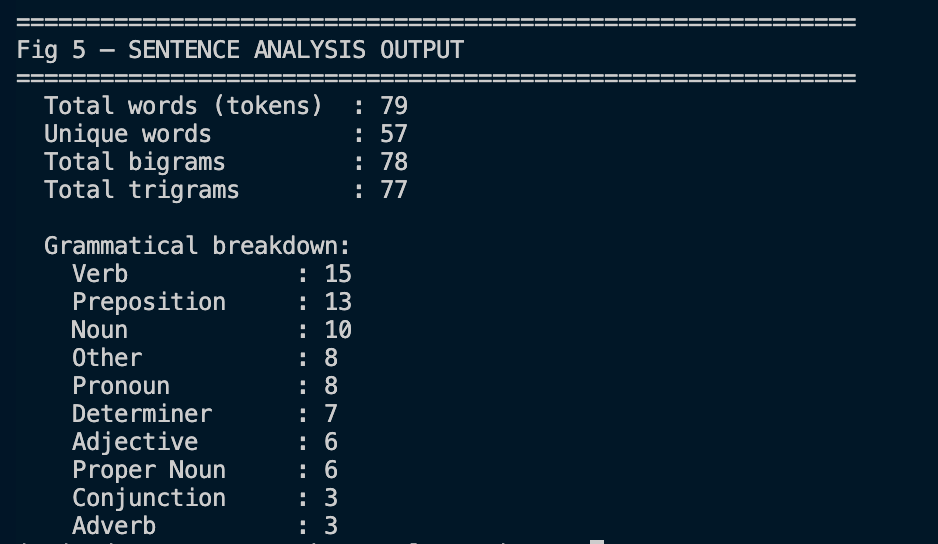
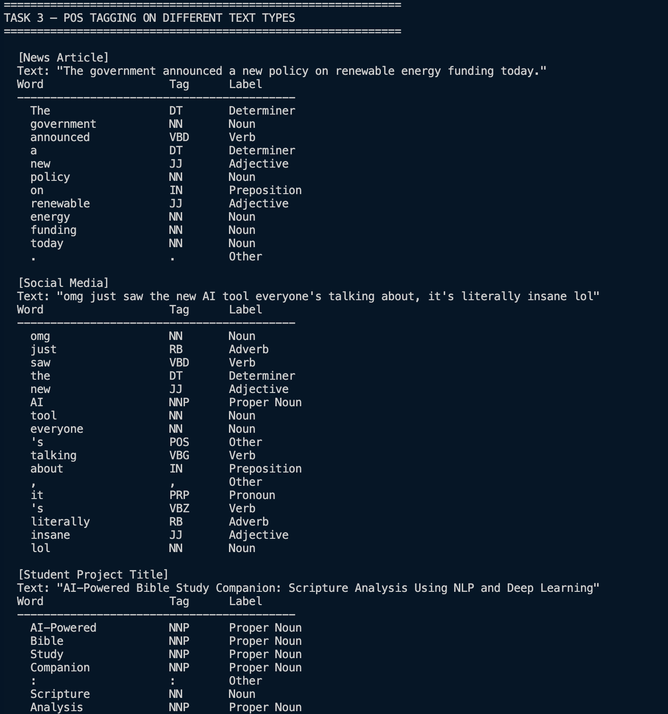

# Week 2 – N-gram Models and POS Tagging

## Task: Language Modeling and Sentence Structure Analysis

### Fig 1 – Bigram and Trigram Output


Fig 1 shows the most frequent two-word (bigram) and three-word (trigram) sequences found in Jude 1:3–4. N-grams reveal recurring word patterns in the text, for example, "unto you" appears multiple times, showing it is a common phrase in this passage.

### Fig 2 – POS Tagging Example


Fig 2 shows the first 20 words from the verse, each labelled with its grammatical role, Noun, Verb, Adjective, etc. POS tagging helps a program understand the structure of a sentence, not just its words.

### Fig 3 – Python Code for POS Tagging


Fig 3 shows the core line of code used: `pos_tag(tokens)`. NLTK's `pos_tag()` takes a list of word tokens and returns a list of `(word, tag)` tuples, e.g. `[('Beloved', 'NNP'), ('gave', 'VBD')]`.

### Fig 4 – Language Prediction Example


Fig 4 demonstrates simple language prediction using bigram frequencies. Given a word (e.g. *unto*), the model looks at all bigrams starting with that word and returns the most likely word to follow. This is the basic principle behind autocomplete and language models.

### Fig 5 – Sentence Analysis Output


Fig 5 provides a complete structural breakdown of the text, total tokens, unique words, bigram and trigram counts, and a grammatical breakdown by POS category.

### Task 3 from notes:


---

## Student Reflection

This week introduced N-gram models and Part-of-Speech tagging using Python and NLTK. N-grams are sequences of consecutive words that reveal language patterns, bigrams capture two-word pairs while trigrams capture three-word sequences. I used these to build a simple next-word predictor on scripture from the Book of Jude. POS tagging then labelled each word with its grammatical role, showing which words are nouns, verbs, or adjectives. The main challenge was understanding the Penn Treebank tag codes, so I mapped them to plain English labels. Both techniques are used directly in my main project's NLP pipeline for keyword extraction and verse analysis.

---

## Running the Code

```bash
pip install nltk
python3 week-2/code/week2_ngrams_pos.py
```
