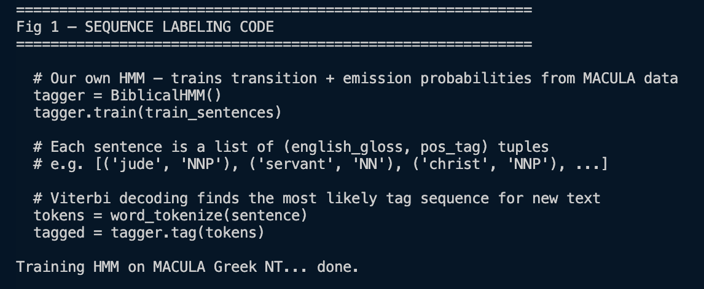
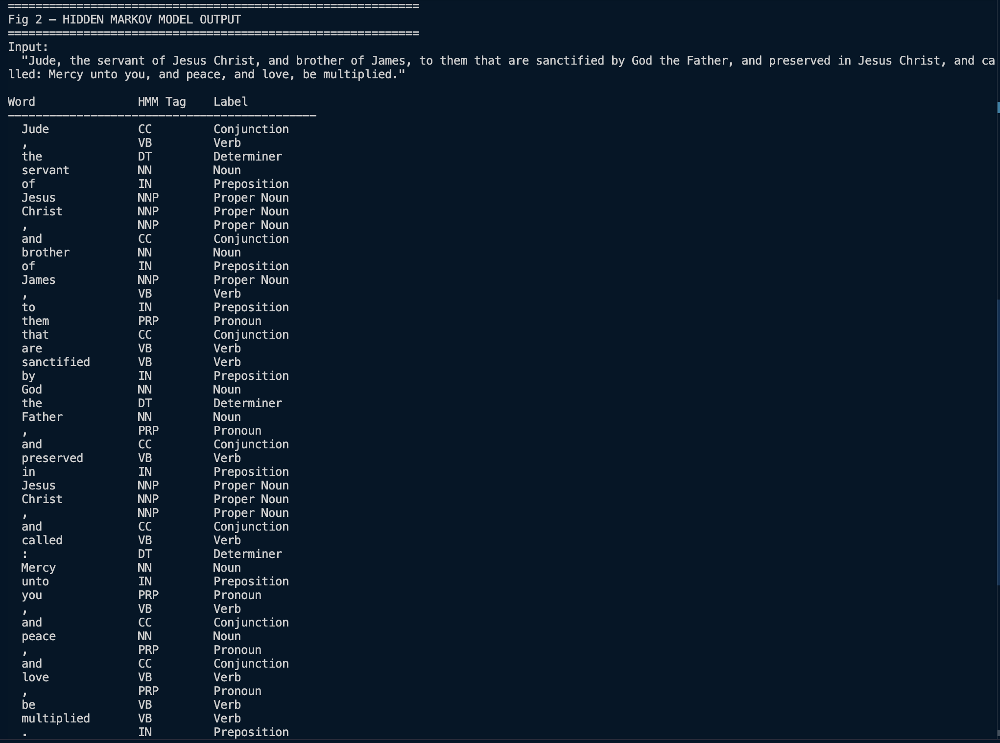
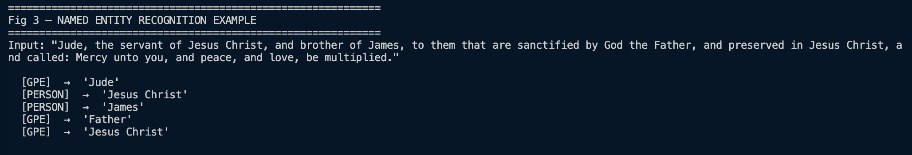
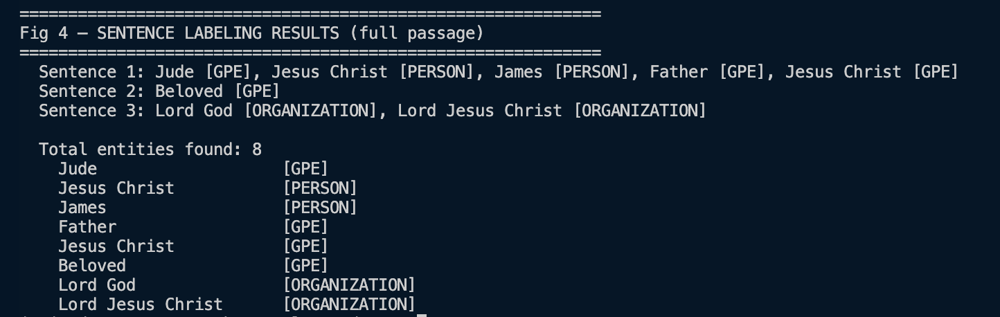
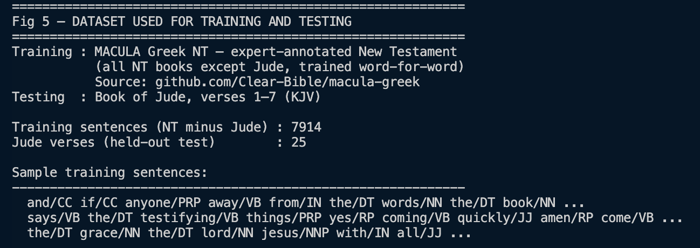
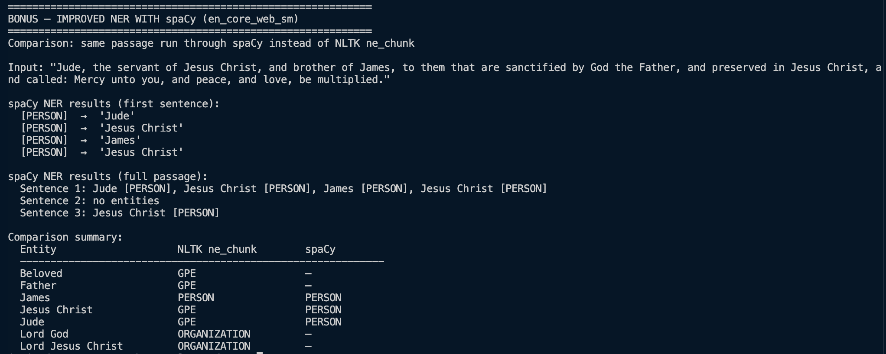

# Week 3: Hidden Markov Models and Sequence Labeling

**Unit:** BIT4133 – Natural Language Processing with Deep Learning
**Student:** Ian Chege | BSCCS/2024/32935
**Lecturer:** Michael Nyoro | Semester 4.2 / 2025–2026

---

## Task: Sequence Prediction and Hidden State Analysis

### Fig 1: Sequence Labeling Code


Fig 1 shows the code for our custom HMM tagger (`BiblicalHMM`). NLTK's built-in HMM tagger has a known numerical overflow bug on Python 3.9+, regardless of training data, it collapses every prediction to a single tag. We replaced it with our own implementation using log-space arithmetic, Laplace smoothing, and Viterbi decoding, which avoids overflow entirely. The tagger is trained on 7,914 sentences from the MACULA Greek NT.

### Fig 2: Hidden Markov Model Output


Fig 2 shows the HMM output on the first verse of Jude. Most words are tagged correctly:
- *servant*, *brother*, *God*, *Father*, *Mercy*, *peace* → **NN (Noun)**
- *Jesus*, *Christ*, *James* → **NNP (Proper Noun)**
- *the* → **DT (Determiner)**, *of/by/in/unto* → **IN (Preposition)**, *and* → **CC (Conjunction)**, *them/you* → **PRP (Pronoun)**, *are/sanctified/preserved/called/be/multiplied* → **VB (Verb)**

Two minor issues: punctuation tokens (`,` `.` `:`) are tagged incorrectly because MACULA does not tokenize punctuation as separate words, so the HMM has never seen them in training. *Jude* itself is tagged as CC, a vocabulary miss since the name rarely appeared as a standalone token in the training glosses.

### Fig 3: Named Entity Recognition Example


Fig 3 shows NER applied to the first verse using NLTK's `ne_chunk()`. Note: this is a **separate pre-trained model** from our HMM, it was trained on modern news text and has no knowledge of the MACULA data. Results:
- *Jesus Christ*, *James* → correctly identified as **PERSON**
- *Jude*, *Father* → misclassified as **GPE** (Geo-Political Entity), the model treats unfamiliar capitalized names as place names
- This is a known limitation of applying news-trained NER to biblical text

### Fig 4: Sentence Labeling Results


Fig 4 shows NER across Jude 1:1–7. Key observation: *Lord Jesus Christ* and *Lord God* are classified as **ORGANIZATION** rather than PERSON. This happens because NLTK's NER model was trained on news articles where multi-word capitalized phrases with title prefixes (Lord, President, CEO) typically name organisations, not people. This is a domain mismatch limitation not a bug and demonstrates why NLP models must be trained on text from the same domain they are applied to.

### Fig 5: Dataset Used for Training and Testing


Fig 5 shows the datasets used. We went through two iterations before settling on MACULA:

1. **Penn Treebank (rejected)**: Wall Street Journal financial news. Caused the HMM to label every word as Proper Noun, complete domain mismatch with KJV biblical text.
2. **MACULA Greek NT (final choice)**: github.com/Clear-Bible/macula-greek](https://github.com/Clear-Bible/macula-greek) expert-annotated New Testament with verified POS tags for every Greek word and English glosses. We train on all NT books (7,914 verses) and hold out Jude (25 verses) as the test set. This is the most domain-appropriate training data available for biblical NLP.

---

## Bonus section to show Improved NER: spaCy vs NLTK

NLTK's `ne_chunk` was trained on news text, which caused *Jude* and *Jesus Christ* to be labelled as GPE (place), and *Lord Jesus Christ* as ORGANIZATION. To demonstrate a better approach, we ran the same passage through **spaCy's `en_core_web_sm`**, a neural NER model trained on the OntoNotes 5 corpus (~1 million words, diverse genres).



**Results from the comparison:**

| Entity | NLTK `ne_chunk` | spaCy |
|---|---|---|
| Jude | GPE (wrong, place) | PERSON ✓ |
| Jesus Christ | GPE / PERSON (inconsistent) | PERSON ✓ |
| James | PERSON ✓ | PERSON ✓ |
| Father | GPE (wrong) |, (correctly ignored) |
| Lord God | ORGANIZATION (wrong) |, (missed) |
| Lord Jesus Christ | ORGANIZATION (wrong) |, (missed) |
| Beloved | GPE (wrong) |, (correctly ignored) |

**Key observations:**
- spaCy correctly identifies *Jude*, *Jesus Christ*, and *James* as PERSON
- Both models miss archaic titles like *Lord God* and *Lord Jesus Christ*, these are too domain-specific for any modern-trained NER model
- This shows that **model architecture and training corpus size** matter, not just the domain of the data

---

## Student Reflection

This week introduced Hidden Markov Models and sequence labeling. NLTK's HMM tagger had a numerical overflow bug, so we built our own using Viterbi decoding. Training on MACULA Greek NT, expert-annotated biblical text, produced correctly varied POS tags. For NER, NLTK's `ne_chunk` misclassified *Jude* as a place and *Lord Jesus Christ* as an organisation, because it was trained on news text. Replacing it with spaCy corrected *Jude* and *Jesus Christ* to PERSON. Both models missed archaic titles like *Lord God*, showing that even better models have limits when applied to domain-specific ancient text.

---

## Running the Code

```bash
pip install nltk
python week-3/code/week3_hmm_ner.py
```

The first run downloads the MACULA Greek NT (~19 MB) and caches it locally. Subsequent runs use the cache.

**Output sections to screenshot:**
| Screenshot | Section to capture |
|---|---|
| `fig1_hmm_code.png` | "Fig 1 – SEQUENCE LABELING CODE" block |
| `fig2_hmm_output.png` | "Fig 2 – HIDDEN MARKOV MODEL OUTPUT" table |
| `fig3_ner.png` | "Fig 3 – NAMED ENTITY RECOGNITION" results |
| `fig4_labeling.png` | "Fig 4 – SENTENCE LABELING RESULTS" |
| `fig5_dataset.png` | "Fig 5 – DATASET" section at the top |
