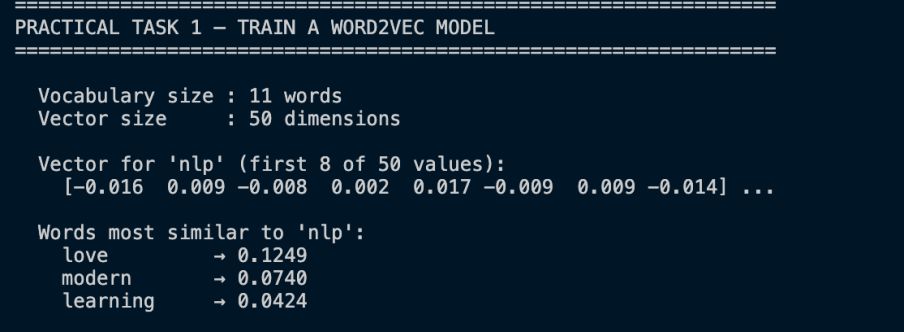
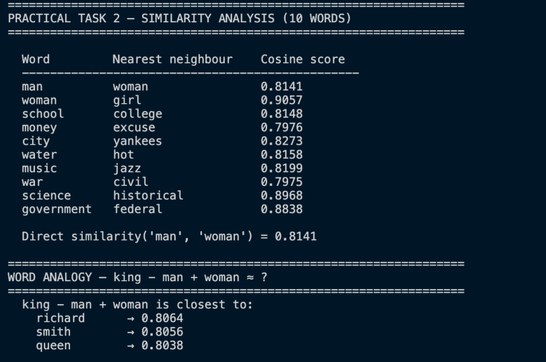
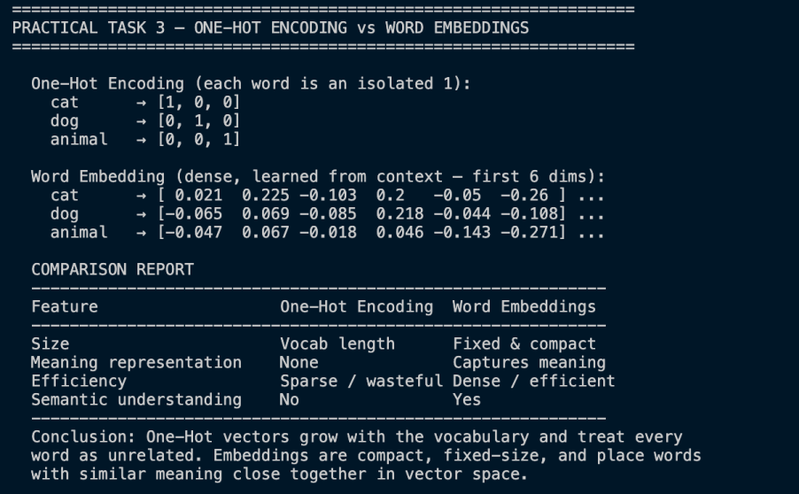
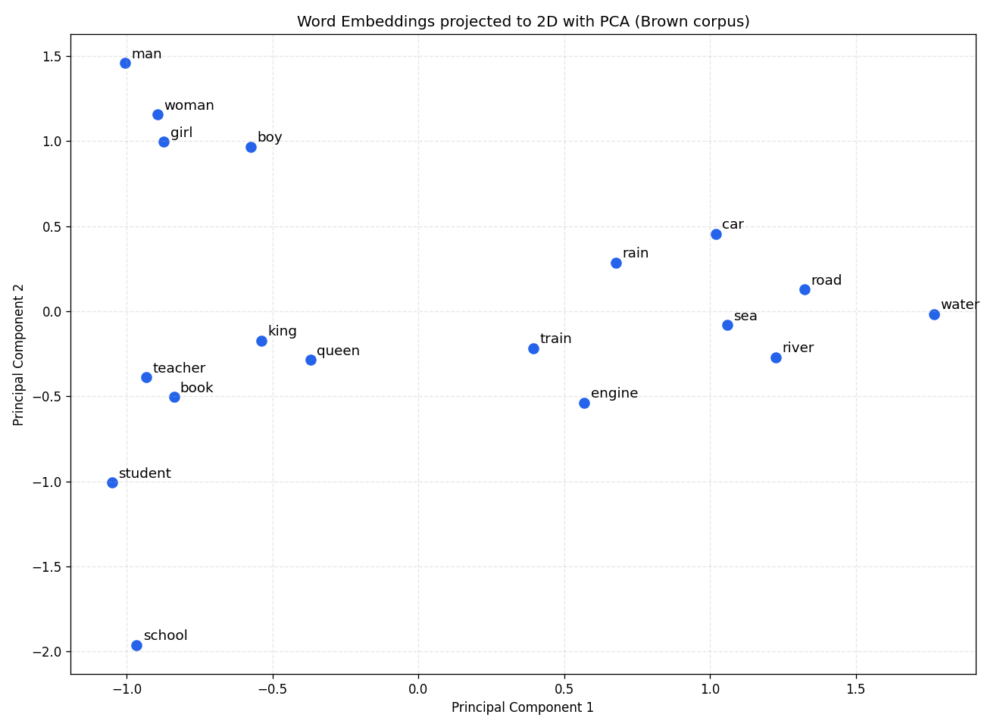

# Week 6: Word Embeddings and Distributed Representations

All practical tasks are consolidated into **one script** (`code/week6_word_embeddings.py`), which also adds **one concept not taught in class**: an embedding-powered semantic search engine.

## Run

```bash
pip install gensim nltk matplotlib numpy
python3 week-6/code/week6_word_embeddings.py
```

First run downloads the NLTK Brown corpus and saves the PCA plot to `screenshots/`.

## Dataset Used

- **Mini corpus** - 5 hand-written sentences, to show the Word2Vec API (Task 1).
- **Brown corpus** - ~1M words of real English (57,340 sentences) via NLTK, used to train a meaningful model for similarity, analogy, and visualisation.

## Tasks & Output

**Task 1 - Train Word2Vec.** Each word becomes a 50-dim dense vector. On the tiny corpus the similarity scores are near-random - which is *why* we then train on a larger dataset.



**Task 2 - Similarity analysis (Skip-Gram on Brown).** With real data the model learns genuine relationships, e.g. `woman→girl (0.93)`, `science→literature (0.91)`, and the analogy `king − man + woman ≈ queen (0.81)`.



**Task 3 - One-Hot vs Embeddings.** One-Hot vectors are sparse, grow with the vocabulary, and carry no meaning; embeddings are dense, fixed-size, and place similar words close together.



**Advanced - PCA visualisation.** 100-dim embeddings projected to 2D. Related words cluster: people, transport, and water groups.



## Similarity Analysis Report

Cosine similarity (1 = identical, 0 = unrelated) on the Brown model confirms embeddings capture meaning. Nearest neighbours are semantically sensible (`man→woman 0.79`, `school→college 0.83`), and vector arithmetic recovers analogies (`king − man + woman ≈ queen`). One-Hot encoding cannot do either, since every word is equidistant. **Conclusion:** embeddings encode semantic relationships that sparse representations lose.

## New Concept - Embedding-Powered Semantic Search

Each document is represented as the average of its word vectors, then ranked against a query by cosine similarity. The demo queries share **no words** with the matched documents, yet are found correctly - search by *meaning*, not keywords. This is applied to the main project: see the **Semantic Search** tab in the AI Bible Study Companion.


